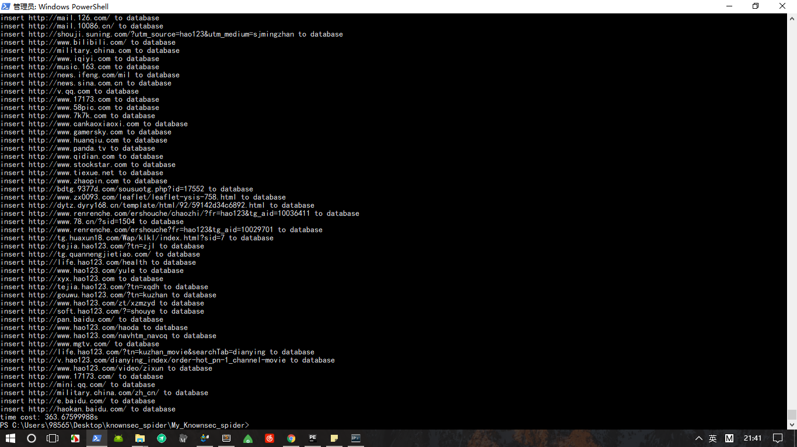

# My_Knownsec_spider

知道创宇爬虫
##### v1 支持 -u -d --dbfile
- args_parser.py 处理命令行参数
- database.py 数据库相关操作
- spider.py 爬虫主体

在命令行中运行，结果如下

`python spider.py -u http:www.baidu.com -d 2 --dbfile baidu.db`

##### Todo
1. 添加log文件
2. 线程池